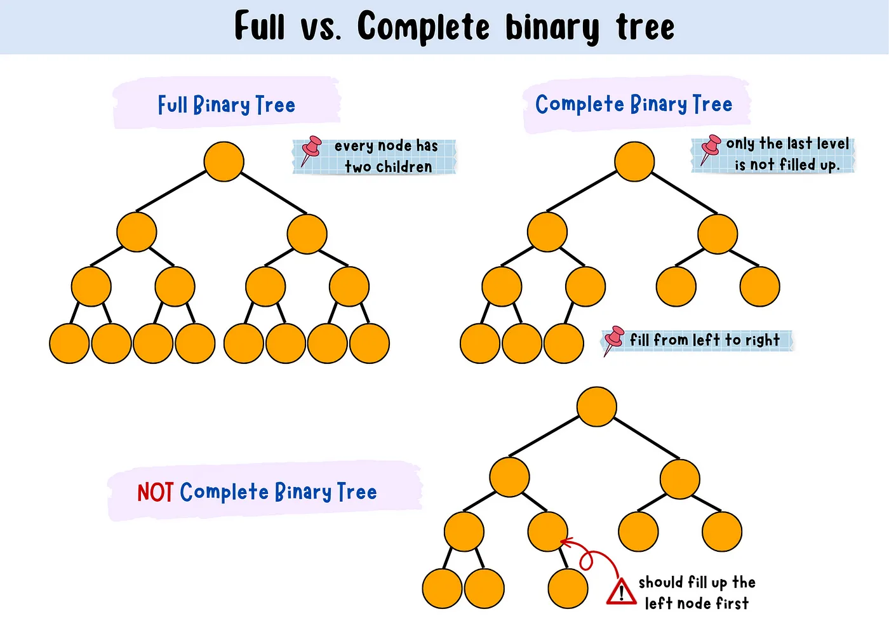

# Heap

Куча (*heap*) — древовидная структура данных (*tree-based data structure*), которая удовлетворяет следующему свойству (свойство кучи, *heap property*): 

- для *max-heap*: для любой  *node* `C`, если `P` – это *parent node* для `C`, то `key(P) ≥ key(C)`. Т.е. *node* с наибольшим *key* всегда является *root node*
- для *min-heap*: `key(P) ≤ key(C)`. Т.е. *node* с наименьшим *key* всегда является *root node*

Структуру данных *heap* не следует путать с понятием *heap* в динамическом распределении памяти. В некоторых ранних популярных языках программирования (Lisp) обеспечивалось динамическое распределение памяти с использованием структуры данных «*heap*», которая и дала своё имя выделяемому объёму памяти.

*Heap* — это одна из максимально эффективных реализаций [priority queue](https://en.wikipedia.org/wiki/Priority_queue), и на самом деле *priority queue* часто называют «*heap*», независимо от того, как они могут быть реализованы. *Heap* является полезной *data structure*, когда необходимо несколько раз удалить объект с самым высоким (или самым низким) *priority* или когда *insertion*'s должны чередоваться с *removal*'s *root node* (как в задаче top-k).

*Heap* не является *sorted structure*; ее можно считать *partially ordered*. Т.е. не существует какого-то определенного порядка между *sibling*'s (братья и сестры) или *cousin*'s и не существует [in-order traversal](https://en.wikipedia.org/wiki/Inorder_traversal) (обхода по порядку), как например для [binary search tree](https://en.wikipedia.org/wiki/Binary_search_tree). 

Для одного и того же набора *element*'ов может существовать несколько вариантов построения *heap* на их основе.

## Binary heap

Наиболее часто используется *binary heap*. 

Пример *binary heap*:

*Binary heap* — это *heap data structure*, которая имеет форму [binary tree](https://en.wikipedia.org/wiki/Binary_tree).

*Binary heap* (двои́чная ку́ча**, **пирами́да) — такое *binary tree*, для которого выполнены три условия:

1. *Heap property* (Свойство *heap*): значение в любой *node* больше либо равно `≥` (или меньше либо равно `≤`), чем значения в *node's children*
2. *Shape property* (свойства формы) – *binary heap* представляет собой *[complete binary tree](https://en.wikipedia.org/wiki/Complete_binary_tree)*:
   1. все уровни *tree*, за исключением, возможно, последнего (самого глубокого), полностью заполнены
   2. глубина всех листьев (расстояние до корня) отличается не более чем на 1 *level*.
   3. *last level* заполняется слева направо без «дырок».

<ins>Применение</ins>:

- пирамидальная сортировка (*heapsort*)
- очередь с приоритетами (*priority queue*, [1](#priority-queue))

## Heap operations

Над *heap* производят операции:

**Basic**

- *find-max* (или *find-min*) – найти *maximum item* в *max-heap* (*minimum item* в *min-heap*) (аналог *[peek](https://en.wikipedia.org/wiki/Peek_(data_type_operation))*)
- *insert* – добавление нового *key* в *heap* (аналог *push*)
- *extract-max* (или *extract-min*) – возвращает *node* с *maximum value* из *max heap* [или с *minimum value* из *min heap*] после удаления ее из *heap* (аналог pop)
- *delete-max* (или *delete-min*) – удаление *root node* из *max heap* (или *min heap*)
- *increase (decrease) key* – увеличить (уменьшить) ключ – обновить некоторый ключ в *heap*

**Creation**

- *heapify* – создать *heap* из заданного *array of element*'ов

**Internal**

- *increase-key* или *decrease-key* – изменение *key* внутри *max-* или *min-heap*
- *sift-up* – переместить *node* вверх по *tree* на столько, на сколько нужно; используется для восстановления *heap condition* после *insertion*. Называется *sift* (просеять), потому что *node* перемещается вверх по *tree*, пока не достигнет правильного *level*, как в [sieve](https://en.wikipedia.org/wiki/Sieve) (сите).
- *sift-down* – переместить *node* вниз по *tree*, аналогично *sift-up*; используется для восстановления *heap condition* после *delete*.

| Operation | find min | delete min (pop) | increase key | insert (push) | remove     | creation | search |
| --------- | -------- | ---------------- | ------------ | ------------- | ---------- | -------- | ------ |
| Binary    | `O(1)`   | `O(logN)`        | `O(logN)`    | `O(logN)`     | `O(log N)` | `O(N)`   | `O(N)` |

Операции *insert* и *delete min* сначала изменяют *heap*, добавляя или удаляя *node* из конца *heap*, за счет этого поддерживают *Shape property*. А затем восстанавливают *Heap property* с помощью *sift-up* или *sift-down* по *heap*. 

### Insert (push)

Чтобы *insert the element* в *heap* необходимо выполнить алгоритм:

1.  *Insert the element* на нижний *level* для *heap* в крайнее левое свободное пространство.
2. Сравните добавленный *element* с его *parent*; если они в правильном порядке, остановитесь.
3. Если нет, *swap the element* c его *parent* и вернитесь к предыдущему шагу.

Шаги 2 и 3 – *sift-up* (*heap-up*).

Т.о. *worst-case time complexity* – `O(log n)` . 

Пример *max-heap*:

мы хотим добавить в *heap* число `15`. Сначала мы помещаем `15` в позицию, отмеченную знаком `X`. Однако *heap property* нарушается, поскольку `15 > 8`, поэтому нам нужно *swap*'нуть `15` и `8`. Итак, после первого *swap* – *heap* выглядит следующим образом:

Однако *heap property* по-прежнему нарушается, поскольку `15 > 11`, поэтому нам нужно снова сделать *swap*:

В результате гарантированно получаем *valid max-heap*, т.к. *root* был больше, чем его *left child*, поэтому замена *root* на еще большее значение сохранит *Heap property* (`11 > 5` и `15 > 11`, поэтому `15 > 5` из-за [transitive relation](https://en.wikipedia.org/wiki/Transitive_relation)).

### Delete (pop)

Алгоритм для извлечения *maximum element*'а из *max-heap* или *minimum element* в *min-heap*):

1. Замените *root* на *last element* на *last level*.
2. Сравните новый *root* с его *children*'s; если они в правильном порядке, остановитесь.
3. Если нет, *swap the element* с *smaller child* в *min-heap* и с *larger child* в *max-heap*. Вернитесь к предыдущему шагу. 

Шаги 2 и 3 называются *sift-down* (*heap-down*)

Т.о. *worst-case time complexity* – `O(log n)` . 

Пример *max-heap*:

Делаем *delete* для `11` и заменяем его на `4`:

*Heap property* нарушено, поскольку `8 > 4`. Делаем `swap` для 4 и наибольшего *child* `8`. *Heap property* восстановлено.

### Remove

Удаление произвольного *element*'а c индексом `i` можно выполнить следующим образом:

1. *Swap* этот *element* с *last element*'ом
2. *Down-heapify* или *up-heapify*, чтобы восстановить *heap property*. В *max-heap (min-heap)*, *up-heapify* требуется только тогда, когда новый ключ элемента `i` больше (меньше), чем предыдущий, поскольку может быть нарушено *heap-property*  для *parent element*. Когда новый ключ меньше (больше), чем предыдущий, тогда требуется только *down-heapify*, поскольку *heap-property* может быть нарушено только в *child element*'ах.

### Building a heap (init)

Построение *heap* из *array* в *n* входных *element*'ов можно выполнить, начав с пустой *heap*, а затем последовательно *insert* каждый *element*. Его *time complexity* `O(N logN)`. 

Этот подход не оптимален. Более быстрый метод начинается с произвольного размещения *element*'ов в *binary tree* с соблюдением *shape property*. Затем, начиная с самого низкого *level* и продвигаясь вверх, необходимо делать sift-down для *root* каждого *subtree*, как в алгоритме для *delete*, пока не дойдешь до самого верха. Т.е. если все *subtree*, начиная с некоторой высоты `h` уже были *heapify* (для самого нижнего *level* `h = 0`), *tree*'s на высоте `h  + 1` могут быть *heapify* с помощью *sift-down*. 

- *time complexity* для отдельной *node* – `O(h)`. 

- Математически выводится, что *time complexity* для всего *tree* – `O(n)`

## Представление *heap*

*Heap* обычно реализуется с помощью *array*. Т.к. *binary heap* всегда является полным *binary tree*, его можно хранить компактно без *pointer*'ов. *Parent* и *children* для каждой *node* можно найти путем арифметических вычислений по *array index*'ам. 

Пусть `n` — количество *element*'ов в *heap*, а `i` – *array index* некоторого элемента из *heap*. Тогда:

- его *child*'s находятся по индексам `2i + 1` и `2i + 2`
- его *parent* находится по индексу `floor((i − 1)/2)`.

Т.о. в *array* первый *index* содержит *root element*. Следующие два *index*'а содержат *root's children*. Следующие четыре *index*'а содержат четыре *children* двух *root's children* и так далее.

## Реализация в Go

[Смотреть тут](https://github.com/parshikovpavel/cheat-sheets/blob/master/Go/packages/container_heap.md)мондлыаоотв